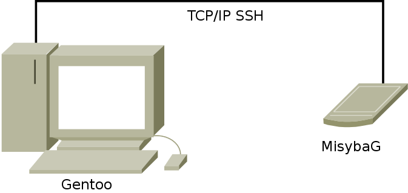

# MisybaG, mini-system based on Gentoo

MisybaG is a system using the Gentoo package manager (_Portage_) from a distant computer. The advantage of deporting the package manager is to be able not to have the toolchain nor package manager tools on the system, allowing to have a very light system. Note that the created system **is not Gentoo**.

In order to keep it very light, only a few packages are part of the system (at the beginning, there almost is only *busybox* and *openssh*).

# Language/langue

Because French is my native language, finding all documents and messages in French is not an option. Other translations are welcome.

Anyway, because English is the language of programming, the code, including variable names and comments, are in English.

:fr: Une version française de ce document se trouve [ici](doc/fr/README.md).

# Licence

Copyright © 2016 Stéphane Veyret stephane_DOT_veyret_AT_neptura_DOT_org

MisybaG is free software: you can redistribute it and/or modify it under the terms of the GNU General Public License as published by the Free Software Foundation, either version 3 of the License, or (at your option) any later version.

MisybaG is distributed in the hope that it will be useful, but WITHOUT ANY WARRANTY; without even the implied warranty of MERCHANTABILITY or FITNESS FOR A PARTICULAR PURPOSE. See the GNU General Public License for more details.

You should have received a copy of the GNU General Public License along with MisybaG.  If not, see <http://www.gnu.org/licenses/>.

# Install

Compilation and installation should be as simple as:

    make && make install

Note that `make install` also support `DESTDIR` variable to install elsewhere than in system root directory.

# Usage

## Preparation

The first phase is preparation. It begins with the new project creation using the command:

    misybag new profile directory

where *profile* represents a MisybaG specific profile, i.e. a sub-directory of /etc/MisybaG/profiles/MisybaG, and *directory* represents the directory in which the project will be created. This last parameter is optional. If not set, creation will be done in current directory. If the specified directory does not exist, it will be created.

This command will generate a whole structure in the project directory:

* The *distroot* directory will contain the full MisybaG system root. This is the point where MisybaG system disk will have to be mounted. Usually, a memory card, USD stick or external disk is first mounted here in order to install the system. After this installation, the system root can be mounted through SSHFS.
* The *_env* file contains environment variables required for the distance functioning. It is possible to source this file to directly work on distant system.
* The *_custom* directory contains scripts executed at key moments. They can be customized in order to complete system installation.
* The *_config* directory contains miscellaneous configuration elements which can be used by customized scripts. This directory also can contain your public key, named *id_rsa.pub*. In this case, this key will be correctly installed in the target system in order to allow SSH connection without password authentication.
* The *_portage* directory contains *Portage* configuration. It can be customized depending on your needs.
* The *_layout* directory contains a directory and file structure which will directly be copied on target.

After execution of the command, you just have to fill in this environment to fit user needs.

After preparation is finished, it is required, in order to go to next steps, that distant file system is mounted on *distroot*.

## Installation

MisybaG system installation is done by the command:

    misybag sys-install

This command should only be executed once. This command terminates with automatic execution of the update.

## Update

In order to update the distant system, one should use the command:

    misybag update

This command only update distant files with *_layout* directory content, and execute customized scripts.
